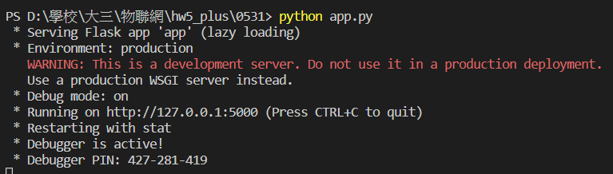
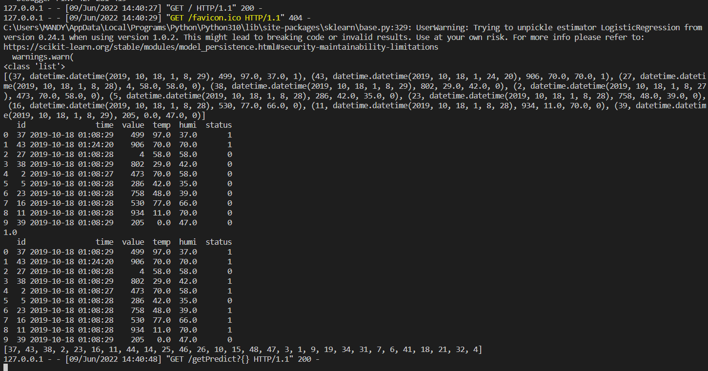
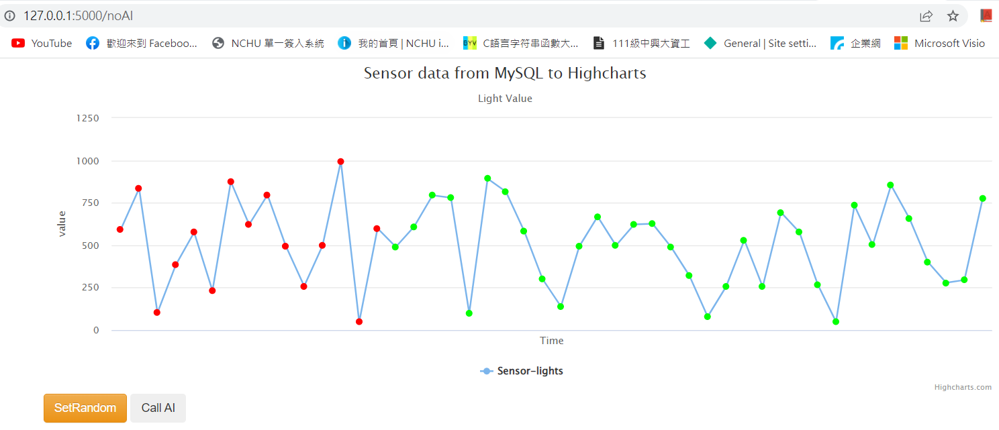
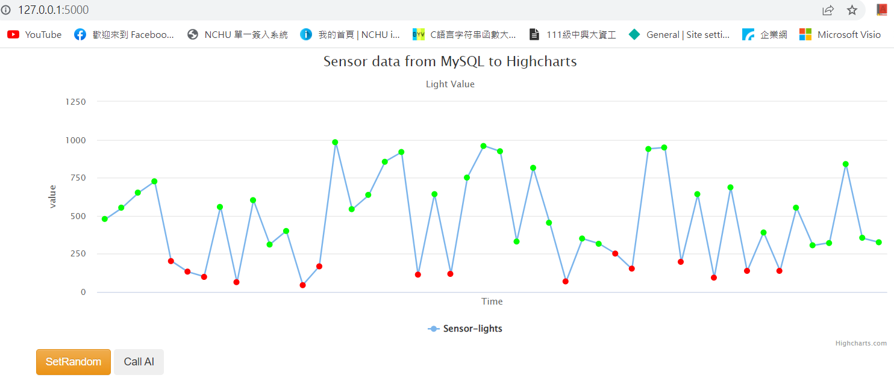

# aiot_hw5_plus

## Lecture 15: IoT Flask Web (deploy to heroku)
### Author: MandyLU

### step 0 : 
* 載HeidiSQL、註冊Heroku

### step 1 : Clone this github
* https://github.com/huanchen1107/aiot0530-start-no-token clone到 \aiot531 資料夾裡
* 把.git這個檔刪掉(為了產生自己的管理員)
* 推送到github上建立新的repo

### step 2 : install some package

```python
pip install gunicorn Flask==2.0.1 Jinja2==3.0.1 psycopg2 sklearn pandas numpy
```

### step 3: add an heroku postgredb
 到heroku建立new app，並新增選用Postgresql
* register heroku account
* go to dashboard
* new an app
* go to resource and add-on an Heroku postgredb

### step 4: login to heroku pstgredb using HeidiSQL

APP_NAME：aiot0531lu
* 開啟heidisql點擊"新增"
* 命名為"<app_name>_herokuapp.com"
* 選定postgredb & 最新版 & 以下內容
```sql
myserver ="ec2-52-204-195-41.compute-1.amazonaws.com
"
myuser="pevlzadduxpnwg"
mypassword="b9f10d763a3ad1f06abb4d923a983fd4c614bb689dc4f6cf9c8ebf7f1d9de725
"
mydb="d59m5e6ap08a52"
Port="5432"
```
### step 5: import postgredb (in db/postgre.db)
* 載入老師的db資料夾中的"postgredb.sql"並執行

### step 6: setting db in app.py


```sql
myserver ="ec2-52-204-195-41.compute-1.amazonaws.com
"
myuser="pevlzadduxpnwg"
mypassword="b9f10d763a3ad1f06abb4d923a983fd4c614bb689dc4f6cf9c8ebf7f1d9de725
"
mydb="d59m5e6ap08a52"
Port="5432"

```
### step 7: testing locally by running python app.py
* run 程式：python app.py
* 測試結果如圖






### step 8: deploy to github (new private github repositoy)

delete .git and git remote add origin master github.com/xxxxx

### step 9: Heroku deploy from github

### step 10: Complete

heroku_link :
https://aiot0531lu.herokuapp.com/noAI

github_link :
https://github.com/mandyluu/aiot_0531
